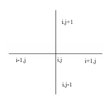

This code is able to solve Poisson's equation for "x" and "y" with time dependency and under Neumann Boundary Condition (NBC). The README summary will be shown as seen below:

# PACKAGES
Five different packages were used:

# Basic Constants and Considerations
The code uses a square lattice where "x" and "y" are in the close interval [0,a]. The charge distribution is placed in the "charge_distribution" function. The "time_sol" function solves the hole system for each time step, for that to happen you need to create two files ("charge" and "poisson"): i)in the first one we want to save the charge distribution to plot in the Python file; ii) the second one is the most important because it saves the PDE solution, the file has a number (filen) where "n" is the number of the time step with that configuration.

# 2-D Laplacian in Finite-Difference Method
The Laplace operator for two dimentions:

In the discrete domain, "x" and "y" become "i" and "j" () and also in my code "", so the above equation becomes:

So we can use the above equation as a matrix, but here we have a real big matrix, because for each  we have  . So if we want to solve an NxN grid, our matrix will have dimension . So that's the reason behind the use of Sparse matrix. 

# PDE
Poisson's equation is well-known:

 
Notice that we need to solve one system for each time step. Also, since we already have the vector "" and the matrix "", but "" is unknown we have a problem like "". For that I used the routine "spsolve" from Armadillo's library.
