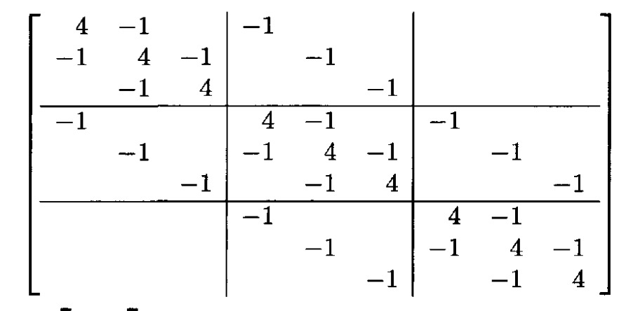

This code is able to solve Poisson's equation for "x" and "y" with time dependency and under Neumann Boundary Condition (NBC). The README summary will be shown as seen below:
\begin{itemize}
    \item Packages;
    \item Basic Constants;
    \item 2-D Laplacian in Finite-Difference method;
    \item PDE;
\end{itemize}

# PACKAGES
Five different packages were used:
\begin{itemize}
    \item Armadillo: for sparse matrix construction and as the system solver;
    \item OPENMP: Armadillo is able to work with OPENMP and improve the code execution time;
    \item LAPACK and BLAS: these both libraries are not really used inside the code, but Armadillo uses them as back-end libraries;
    \item Math: basic math library for constants and basic functions (exponencial, pi, euler's constant ...)
    \item SuperLU : only if you want to use big sparse matrices;
\end{itemize}

# Basic Constants and Considerations
The code uses a square lattice where "x" and "y" are in the close interval [0,a]. The charge distribution is placed in the "charge_distribution" function. The "time_sol" function solves the hole system for each time step, for that to happen you need to create two files ("charge" and "poisson"): i)in the first one we want to save the charge distribution to plot in the Python file; ii) the second one is the most important because it saves the PDE solution, the file has a number (filen) where "n" is the number of the time step with that configuration.

# 2-D Laplacian in Finite-Difference Method
The Laplace operator for two dimentions:

\begin{equation*}
    \nabla ^2 f(x,y) = \frac{d^2f(x,y)}{dx^2} + \frac{d^2f(x,y)}{dy^2}
\end{equation*}

In the discrete domain, "x" and "y" become "i" and "j" ($f(x,y) -> f_{ij}$) and also in my code "$dx = dy = \Delta$", so the above equation becomes:

\begin{equation*}
    \nabla ^2 f(x,y) = \frac{f_{i-1,j}+f_{i+1,j}-2f_{i,j}}{\Delta ^2} + \frac{f_{i,j-1}+f_{i,j+1}-2f_{i,j}}{\Delta ^2} = \frac{f_{i-1,j}+f_{i+1,j}+f_{i,j-1}+f_{i,j+1}-4f_{i,j}}{\Delta ^2}
\end{equation*}

So we can use the above equation as a matrix, but here we have a real big matrix, because for each $i = m (m=[0,n))$ we have $"n"$ $y$. So if we want to solve an NxN grid, our matrix will have dimension $N^2xN^2$. So that's the reason behind the use of Sparse matrix. 

# PDE
Poisson's equation is well-known:

\begin{equation*}
    \nabla ^2 f_{ij,t} = \rho_{ij,t}
\end{equation*}
 
Notice that we need to solve one system for each time step. Also, since we already have the vector "$\rho_{ij,t}$" and the matrix "$\nabla ^2$", but "$f_{ij,t}$" is unknown we have a problem like "$Ax = b$". For that I used the routine "spsolve" from Armadillo's library.
